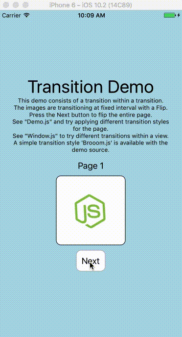

# react-native-transition
A fully customizable view transition library for react-native. The library
could be used to transition entire screens or small parts within a View.

The library has been designed to use customizable transition styles, that
could be easily created and plugged into the application. Checkout the
[Custom Transitions](#custom-transitions) section to learn more about creating
transitions.

Check out a demo application available at
[Transition Demo](https://github.com/sharingapples/react-native-transition-demo).  


### Installation
` $ npm install --save react-native-transition`

### Usage

1. Import `createTransition` and transition styles from the library  
   <code>import { createTransition, FlipX } from 'react-native-transition';</code>

2. Create a transition component with optional styles  
   <code>const Transition = createTransition(FlipX);</code>

3. Render the initial view within the `Transition` component  
   <code>
   &lt;Transition&gt;
   &lt;View&gt;...&lt;View&gt;
   &lt;/Transition&gt;
   </code>

4. Use the show method from component to perform transition  
   <code>
     onPress = (e) => { Transition.show(&lt;View&gt; ... &lt;/View&gt;); }
   </code>

#### Example
```javascript
import React, { Component } from 'react';
import { View, Text } from 'react-native';

import { createTransition, FlipX } from 'react-native-transition';

const Transition = createTransition(FlipX);

class YourView extends Component {
  this.switch = () => {
    Transition.show(
      <View style={{ flex: 1, alignItems: 'center' }}>
        <Text>This is another view</Text>
      </View>
    );
  }

  render() {
    return (
      <Transition>
        <View style={{ flex: 1, alignItems: 'center' }}>
          <Text>This the initial View</Text>
          <Button title="Press to Switch" onPress={this.switch} />
        </View>
      </Transition>
    );
  }
}
```

For a more complete example, checkout [Demo.js](https://github.com/sharingapples/react-native-transition-demo/tree/master/src/Demo.js)
and [Window.js](https://github.com/sharingapples/react-native-transition-demo/tree/master/src/Window.js) from
[react-native-transition-demo](https://github.com/sharingapples/react-native-transition-demo).

### createTransition([style], [animation])
Creates a Transition component used for providing transitionable view.

#### Arguments
1. `style` (object): A transition style definition object. Stock transition styles - `Fade`,
`FlipX`, `FlipY`, `SlideLeft`, `SlideRight`, `SlideUp`, `SlideDown` are available
with the libraries. By default `Fade` transition is used.

2. `animation` (function): Animation used for performing the transition. It could
be one of the `Animated.timing`, `Animated.spring` or `Animated.decay` provided
by react-native animation library.

### Transition component
The `Transition` component should have **one and only one element** as a child.
This child element is rendered before any transition takes place. Once the
transition has occured, this initial child would not be mounted.

#### Methods
**show(element, [style], [animation])**
The `show` method triggers the transition with the provided element appearing
through transition.

This method is available both as static as well as instance method of the
component. In most of the cases, the static method could be used, while for
some advanced use cases where the Transition component is placed on inner
views and are being transitioned on automatic intervals, instance method
could be used for a much individual instance access through `refs`.

**Arguments**
> **element** *(Element)*: The element that needs to be rendered via transition.  
> **style** *(object)*: Override the transition style for this specific transition.  
> **animation** *(function)*: Override the transition animation for this specific transition.  

**Returns** A unique id that represents the transition of this particular element which
could be used to track the completion of the transition.

> *Note: In case an element is added faster than being transitioned in. The visual
transition will be skipped for the intermediate elements. The `onTransitioned` callback
however will be called for all the elements even those skipped in the order that
they were supposed to be shown*

#### Props
**onTransitioned**: A function which is called for every item that has been shown
with the transition. The function is called with the **uniqueId** returned by `show`
method.

Any other props passed to the `Transition` component is passed as `config` parameter
to the `animation` function. If you are using a `Animated.timing` animation, you
could pass `duration` or `easing` props and so on.

### Custom Transitions
The transition library comes with stock transitions which are limited, but
can be easily extended by creating your own custom transitions. However, you must
have knowledge of how animation works in react-native.

A transition object should have two properties - `out` and `in`. The `out`
property creates the style required for the view that is transitioning out
and the `in` property creates the same for the incoming view. Both the `in`
and `out` properties should be function call that returns a new style object
for the respective container view. The function has following parameters:
> **value** (`Animated.Value`)  
> An animated value that runs from `0` to `1` during the transition. The
various style attributes take interpolated values from this value. Go
through the react-native Animation docs for details on using interpolation.
>
> **bounds** ({ width, height })  
> Some animation styles need to know the size of the view being transitioned.
>
> **props**
> The props that was passed to the `Transition` component.

#### Example transition - Slide
```javascript
const Slide = {
  out: (value, bounds) => ({
    left: value.interpolate({
      inputValue: [0, 1],
      outputValue: [0, -bounds.width],
    }),
    width: bounds.width,
  }),
  in: (value, bounds) => ({
    left: value.interpolate({
      inputValue: [0, 1],
      outputValue: [bounds.width, 0],
    }),
    width: bounds.width,
  }),
};
```

#### Example transition - Brooom
```javascript
const Brooom = {
  out: (value, bounds) => ({
    left: value.interpolate({
      inputRange: [0, 1],
      outputRange: [0, -bounds.width],
    }),
    width: bounds.width,
    transform: [{
      skewX: value.interpolate({
        inputRange: [0, 0.1, 0.9, 1],
        outputRange: ["0deg", "-20deg", "-20deg", "0deg"],
      }),
    }],
  }),
  in: (value, bounds) => ({
    left: value.interpolate({
      inputRange: [0, 1],
      outputRange: [bounds.width, 0],
    }),
    width: bounds.width,
    transform: [{
      skewX: value.interpolate({
        inputRange: [0, 0.1, 0.9, 1],
        outputRange: ["0deg", "-20deg", "-20deg", "0deg"],
      }),
    }],
  }),
};
```

